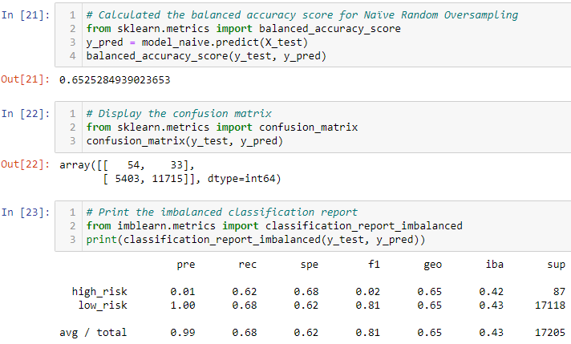
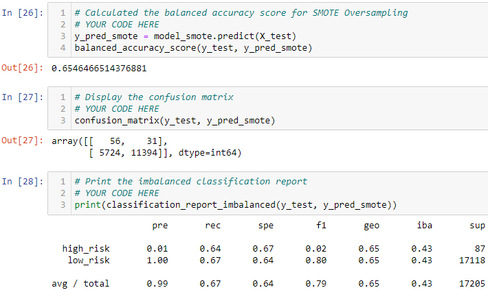
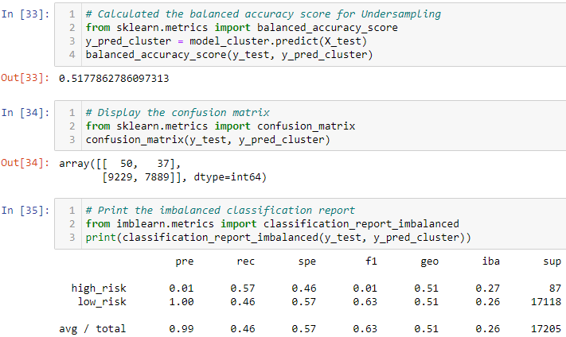
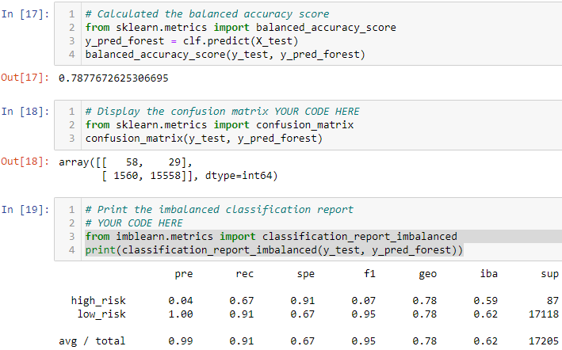
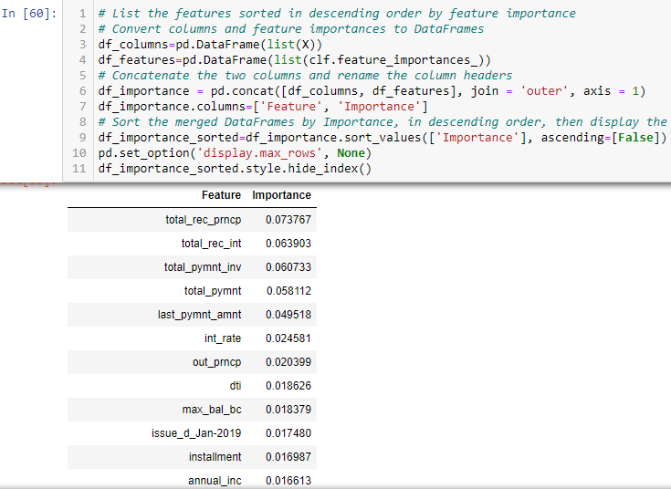
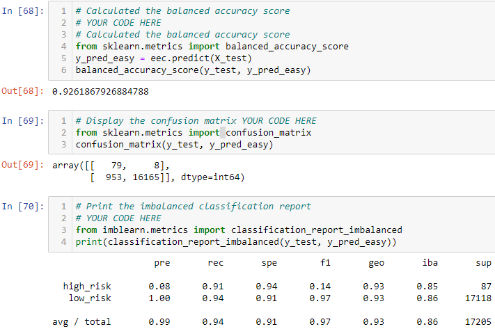
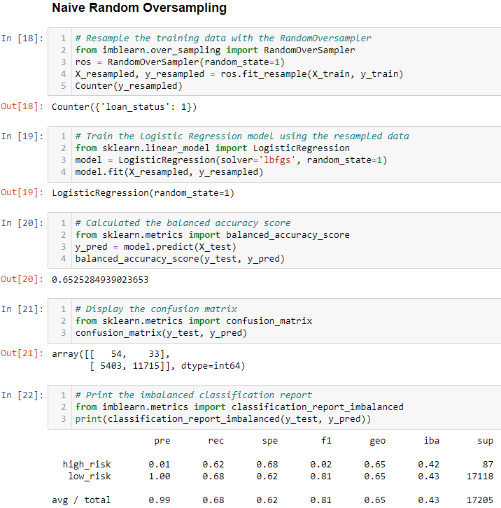

# Credit Risk Analysis

### Deliverable 1: Use Resampling Models to Predict Credit Risk  

This section presents an analysis of each of the following algorithms:

#### Naïve Random Oversampling

#### SMOTE Oversampling

#### Undersampling with ClusterCentroids algorithm

Below are screenshots showing the following results of each of the algorithms:
#### Naïve Random Oversampling: Accuracy Score, Confusion Matrix, and Imbalanced Classification Report

#### SMOTE Oversampling: Accuracy Score, Confusion Matrix, and Imbalanced Classification Report

#### Undersampling with ClusterCentroids: Accuracy Score, Confusion Matrix, and Imbalanced Classification Report

### Deliverable 2: Use the SMOTEENN algorithm to Predict Credit Risk
This section presents an analysis of the <b>SMOTEENN</b> algorithm. Below is a screenshot of the results:
#### Combination (Over and Under) Sampling: Accuracy Score, Confusion Matrix, and Imbalanced Classification Report
_Sampling_2.png)
### Deliverable 3: Use Ensemble Classifiers to Predict Credit Risk
This section presents an analysis of each of the following ensemble classifiers:

#### Balanced Random Forest Classifier

#### Easy Ensemble AdaBoost Classifier

Below are screenshots showing the following results of each of the algorithms:
#### Balanced Random Forest Classifier: Accuracy Score, Confusion Matrix, and Imbalanced Classification Report

#### Features sorted in descending order by feature importance

#### Easy Ensemble AdaBoost Classifier: Accuracy Score, Confusion Matrix, and Imbalanced Classification Report

## Overview of the analysis: Explain the purpose of this analysis (2 points)

(4 points) The purpose of this analysis is to evaluate several machine learning models by using resampling to determine which models are best at predicting credit risk.

### The models include the following:

Naïve Random Oversampling

SMOTE Oversampling

Undersampling

Combination (Over and Under) Sampling

Results: Using bulleted lists, describe the balanced accuracy scores and the precision and recall scores of all six machine learning models. Use screenshots of your outputs to support your results.

Summary: Summarize the results of the machine learning models, and include a recommendation on the model to use, if any. If you do not recommend any of the models, justify your reasoning.

## Summary of the results (2 points)
## Recommendation of which model to use (3 points)

