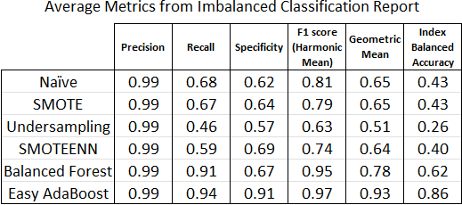

# Credit Risk Analysis

### Deliverable 1: Use Resampling Models to Predict Credit Risk  
This section presents an analysis of each of the following algorithms:
#### ⚫ Naïve Random Oversampling
#### ⚫ SMOTE Oversampling
#### ⚫ Undersampling with ClusterCentroids
Below are screenshots showing the following results of each of the algorithms:
#### Naïve Random Oversampling: Accuracy Score, Confusion Matrix, and Imbalanced Classification Report

#### SMOTE Oversampling: Accuracy Score, Confusion Matrix, and Imbalanced Classification Report

#### Undersampling with ClusterCentroids: Accuracy Score, Confusion Matrix, and Imbalanced Classification Report

### Deliverable 2: Use the SMOTEENN algorithm to Predict Credit Risk
This section presents an analysis of the Combination (Over and Under) Sampling algorithm, also known as the <b>SMOTEENN</b> algorithm. Below is a screenshot of the results:
#### Combination (Over and Under) Sampling: Accuracy Score, Confusion Matrix, and Imbalanced Classification Report
_Sampling_2.png)
### Deliverable 3: Use Ensemble Classifiers to Predict Credit Risk
This section presents an analysis of each of the following ensemble classifiers:
#### ⚫ Balanced Random Forest Classifier
#### ⚫ Easy Ensemble AdaBoost Classifier
Below are screenshots showing the following results of each of the algorithms:
#### Balanced Random Forest Classifier: Accuracy Score, Confusion Matrix, and Imbalanced Classification Report

#### Features sorted in descending order by feature importance

#### Easy Ensemble AdaBoost Classifier: Accuracy Score, Confusion Matrix, and Imbalanced Classification Report

### Deliverable 4: Written Report on the Credit Risk Analysis

The purpose of this analysis is to evaluate several machine learning models by using resampling models and ensemble classifiers to determine which models are best at predicting credit risk.

Resampling models include the following:

#### ⚫ Naïve Random Oversampling
#### ⚫ SMOTE Oversampling
#### ⚫ Undersampling with ClusterCentroids
#### ⚫ Combination (Over and Under) Sampling, a.k.a. SMOTEENN

Ensemble classifiers include the following:

#### ⚫ Balanced Random Forest Classifier
#### ⚫ Easy Ensemble AdaBoost Classifier

Results: Using bulleted lists, describe the balanced accuracy scores and the precision and recall scores of all six machine learning models. Use screenshots of your outputs to support your results.

Here is a table showing the balanced accuracy scores of each model, or simply the percentage of predictions that are correct:

The Easy Ensemble AdaBoost Classifer achieved the best results, with an accuracy score of 92.6%. The other ensemble classifier, Balanced Random Forest, was next with a 78.8% accuracy score. Undersampling with ClusterCentroids achieved the worst results at 51.8%. The two oversampling algorithms, Naïve Random and SMOTE, were both in the middle of the range at a little over 65%, while SMOTEEENN faired slightly worse at just under 64%.

Here is a comparision of the confusion matrices for each of the models:

• TP: True Positive
• FN: False Negative
• FP: False Positive
• TN: True Negative

Here is a comparision of the average metrics from each of the imbalanced classification reports for each of the six models:

## Summary of the results

The average precision score for all models was 99%. This was because the number of high-risk credit applications, relative to the number of low-risk credit applications, was small. The significant differences between the models appeared in the other metrics.  

Summarize the results of the machine learning models, and include a recommendation on the model to use, if any. If you do not recommend any of the models, justify your reasoning.

## Summary of the results (2 points)
## Recommendation of which model to use (3 points)
